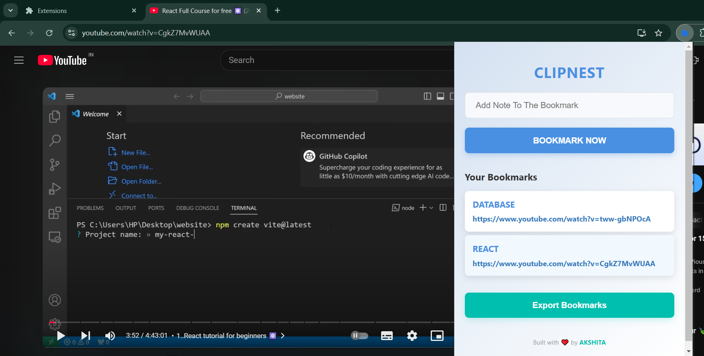

# ClipNest

ClipNest is a feature-rich Chrome browser extension designed to enhance the video-watching experience by enabling users to bookmark YouTube videos (or videos from other platforms) along with custom notes. This project makes organizing and revisiting favorite clips more efficient and user-friendly.


## Features

1. Bookmarking with Notes:
Users can save the current video URL along with a personalized note to remember why the video is important or for what purpose it was saved.

2. Dynamic Bookmark List:
Bookmarked videos are displayed in a list within the extension, featuring the note as a heading and the video URL as a clickable link that opens in a new tab.

3. Export Bookmarks:
Bookmarks can be exported as a JSON file, enabling users to back up their data or share it across devices.

4. Responsive Interface:
- Intuitive controls for adding, displaying, and exporting bookmarks.
- Clean and organized layout for viewing saved clips and notes.

5. Persistent Storage:
The extension stores bookmarks using Chrome's storage system, ensuring that data remains available even after the browser is closed.





## Technologies Used:

- **JavaScript**: Handles the logic for bookmarking, updating the display, and exporting data.
- **Chrome Extensions API**: Facilitates interactions with browser tabs, storage, and runtime messaging for seamless functionality.
- **HTML & CSS**: Provides the UI for the extension's popup, ensuring a simple and user-friendly design.
## Installation

1. Clone the project

```bash
  git clone https://github.com/gupta03akshita/Clip-Nest.git
```

2. Enable Developer Mode in Chrome:

- Open Chrome and go to chrome://extensions/.
- Enable Developer Mode by toggling the switch in the top-right corner.

3. Load Unpacked Extension:
- Click the "Load unpacked" button.
- Select the folder containing the ClipNest source files (make sure manifest.json is in the root of the folder).

4. Verify Installation:
The ClipNest icon will appear in the Chrome toolbar. If not, click the extensions icon (puzzle piece) and pin ClipNest.


## Using ClipNest

1. Add a Bookmark:
- Navigate to a video you want to bookmark.
- Click the ClipNest icon in the Chrome toolbar to open the popup.
- Enter a descriptive note in the "Note" field.
- Click the "Add Bookmark" button.
- The video’s URL and your note will be saved to the bookmark list.

2. View Saved Bookmarks:
- Open the ClipNest popup.
- The saved bookmarks are displayed in a list with:
    - A note heading to identify the bookmark.
    - A clickable link to open the video in a new tab.

3. Export Bookmarks:
- Click the "Export" button in the popup.
- A JSON file (bookmarks.json) containing all your saved bookmarks and notes will be downloaded to your device.
- You can use this file for backup or sharing.


## Ideal Use Cases:

- Bookmarking educational videos with notes about specific topics or timestamps.
- Saving favorite or interesting clips for future reference with quick accessibility.
- Organizing a curated collection of video resources for professional or personal projects.

ClipNest empowers users to manage their video bookmarks effortlessly, making it an essential tool for students, professionals, and casual viewers alike.

